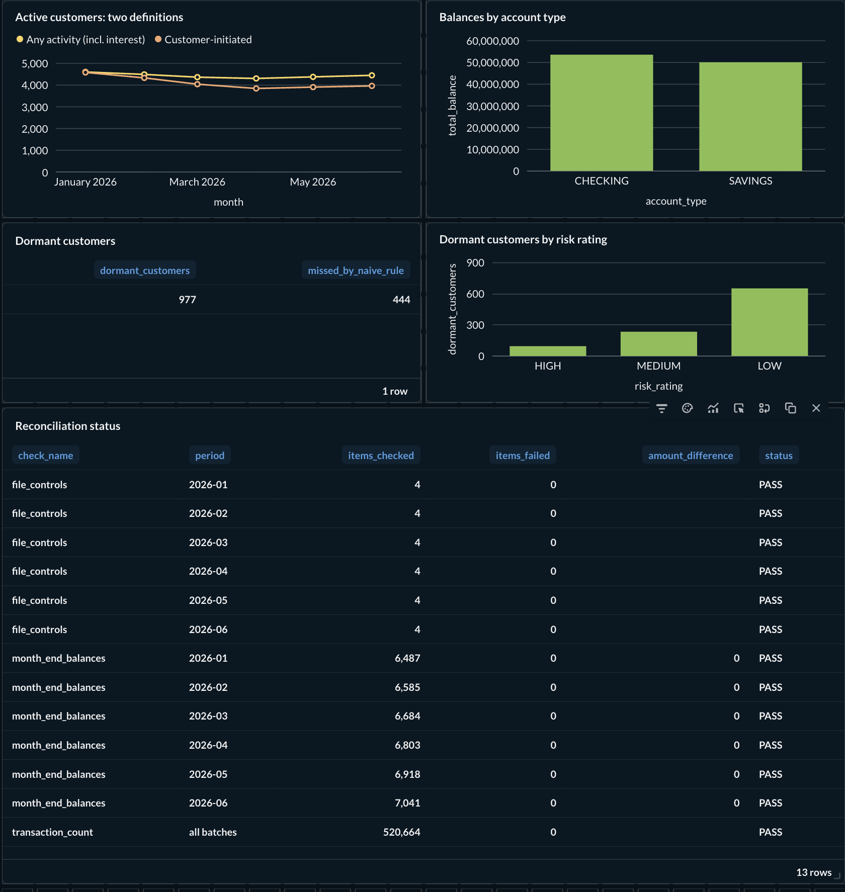
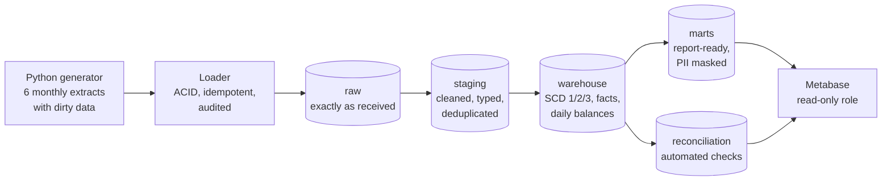
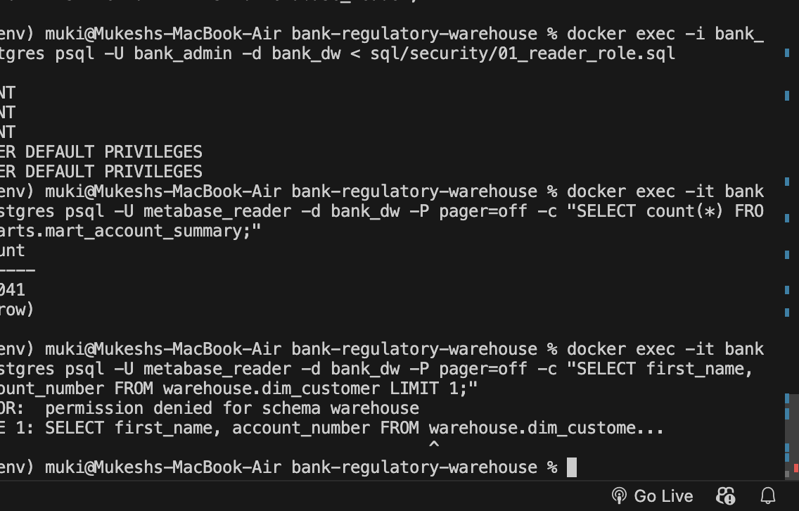

# Bank Regulatory Reporting Warehouse

An end-to-end data warehouse that simulates how a bank prepares data for
regulatory reporting: messy source extracts in, reconciled and auditable
numbers out. Every reported figure can be traced back to the exact line of the
exact source file it came from.



## The problem

Banks must send accurate reports to regulators and auditors. In practice,
source systems deliver duplicates, late records and inconsistent formatting;
customer details change over time; and every reported number must reconcile to
the source system and be fully traceable. This project simulates that whole
process on a laptop, including a real reconciliation failure and its fix.

## Architecture



| Layer | Role | Analogy |
|---|---|---|
| `raw` | Every extract kept exactly as received, all columns as text, plus audit columns | Data lake |
| `staging` + `warehouse` | Cleaned, typed, deduplicated, modelled with history | Data warehouse (single source of truth) |
| `marts` | Small, report-ready tables for specific users, PII masked | Data marts |

**Stack:** Python (Faker, psycopg2) · PostgreSQL 16 · dbt 1.12 · Docker Compose · Metabase

## What it demonstrates

| Topic | Where |
|---|---|
| Data lake vs warehouse vs mart | `raw` → `staging`/`warehouse` → `marts` schemas |
| SCD Type 1 / 2 / 3 | `dim_customer`, `dim_customer_scd2`, `dim_customer_risk_scd3` |
| SQL: no transactions in 90 days | `mart_dormant_customers` |
| SQL: running account balance | `fct_account_daily_balance` (window function) |
| Preventing downstream duplicates | Cross-batch dedup in `stg_transactions`, `unique` tests, idempotent loader |
| Source ↔ warehouse reconciliation | `models/reconciliation/`, `assert_reconciliation_passes` test |
| Inconsistent balances in a report | [INCIDENT-001](docs/incident_001_balance_breaks.md) |
| Audit and lineage | `_batch_id`, `_source_file`, `_source_row`, `_loaded_at`, `audit.load_log`, dbt lineage graph |
| Securing sensitive data | Masking macros in marts + read-only database role |
| Different KPIs from the same data | [KPI definitions](docs/kpi_definitions.md), `mart_active_customer_kpis` |
| "Monthly load slowed 2h → 8h" | [Performance investigation](docs/performance_investigation.md) |
| ACID | One transaction per batch in `loader/load_raw.py`, proven with `--simulate-crash` |

## Highlights

### Reconciliation caught a real bug

The first full run failed the reconciliation test: warehouse balances did not
match the core banking system's official balances, with 414 accounts off by a
total of 186,859.24 by June. File-level controls all passed, so the problem was
inside the pipeline. Lineage columns showed duplicate transactions with the same
`transaction_id` but different `_batch_id`: the source system re-sends some
transactions in the following month's file, and deduplication only worked
within a single batch.

Fixed by deduplicating across all batches, and prevented from recurring with a
uniqueness test. All 520,664 transactions now exist exactly once, and every
account's month-end balance matches the official figure to the cent.
**Full write-up: [INCIDENT-001](docs/incident_001_balance_breaks.md).**

### SCD Type 2: full customer history

Customer `C002852`, reconstructed from monthly snapshots:

| Version | Change | Valid from | Valid to |
|---|---|---|---|
| 1 | Dennishaven, VI, MEDIUM risk | 2020-03-24 | 2026-03-29 |
| 2 | Risk raised to HIGH | 2026-03-29 | 2026-05-11 |
| 3 | Moved to East Elizabeth, DE | 2026-05-11 | 2026-06-13 |
| 4 | Risk lowered to LOW (current) | 2026-06-13 | 9999-12-31 |

`fct_transactions` uses a point-in-time join, so each transaction carries the
risk rating that was valid *when it happened*.

### The "dormant customer" trap

Savings accounts receive monthly interest from the system even when the
customer does nothing. A naive "no transactions in 90 days" rule would have
missed **444 of the 977** dormant customers (45%). The report counts only
customer-initiated activity.

### One dataset, two KPI definitions

"Active customers" counted as *any activity* vs *customer-initiated*: the gap
grows from 21 in January to 484 in June. The first definition hides a real
decline in engagement. Both are documented in
[KPI definitions](docs/kpi_definitions.md).

### Performance: indexing vs partitioning (6M rows)

| Operation | No index | Indexed | Partitioned by month |
|---|---|---|---|
| Monthly report | 0.366s | 0.507s (1.4x slower) | 0.208s (1.8x faster) |
| Account lookup | 0.255s | 0.001s (202x faster) | 0.001s (243x faster) |
| Monthly reload | 3.396s | 10.888s (3.2x slower) | 3.149s (1.1x faster) |

Indexes made lookups 200x faster but made the monthly reload 3.2x slower,
a realistic cause of a load creeping from 2 to 8 hours. Partitioning matched the
indexed lookup speed with a 3.5x faster reload than the indexed table.
**Full analysis: [Performance investigation](docs/performance_investigation.md).**

### Security: masking plus access control

Marts expose only masked values (`******6127`, `R*** T***`, `ro***@yahoo.com`),
enforced by a test that fails if a full account number ever leaks. Metabase
connects with a read-only role that cannot even see the warehouse schema:



## Dirty data simulated on purpose

- Duplicate transactions within a file, and re-sent in the next month's file
- Late-arriving transactions (last month's activity in this month's file)
- Messy customer fields: extra spaces, inconsistent casing, missing emails
- Customer changes over time: address moves, risk rating changes, email updates
- Dormant customers, with system interest that hides their dormancy

## Design decisions

- **Raw stores everything as text.** Raw never rejects a row because of a bad
  date or number; typing and validation happen in staging, where they can be tested.
- **SCD Type 2 is rebuilt from retained snapshots** rather than dbt snapshots.
  Because raw keeps every extract, history can be regenerated at any time; a
  lost snapshot table cannot.
- **Idempotency is not deduplication.** Reloading a batch replaces it (safe to
  rerun), but raw deliberately keeps duplicates that exist in the source file.
  Removing them is the warehouse's job.
- **Money is handled as integer cents** in the generator and `NUMERIC` in the
  database, never floating point.
- **Fixed random seed**, so every run produces identical data and bugs are reproducible.

## Run it yourself

Requires Docker Desktop and Python 3.12.

```bash
git clone https://github.com/<your-username>/bank-regulatory-warehouse.git
cd bank-regulatory-warehouse

python3.12 -m venv .venv
source .venv/bin/activate
pip install -r requirements.txt

docker compose up -d                       # Postgres + Metabase
python data_generator/generate_data.py     # 6 monthly extracts
python loader/load_raw.py                  # load the raw layer

cd dbt_project
dbt build                                  # all models + all tests
dbt docs generate && dbt docs serve        # lineage graph at localhost:8080
cd ..

# read-only role for dashboards (after dbt has created the schemas)
docker exec -i bank_postgres psql -U bank_admin -d bank_dw < sql/security/01_reader_role.sql

python benchmarks/run_benchmark.py         # optional performance experiment
```

Metabase runs at `localhost:3000`. Connect with host `postgres`, database
`bank_dw`, user `metabase_reader`.

## Repository layout


```
├── data_generator/     fake banking extracts with deliberate dirty data
├── loader/             ACID, idempotent, audited raw loader
├── dbt_project/
│   ├── models/         staging, warehouse, marts, reconciliation
│   ├── macros/         schema naming, PII masking
│   └── tests/          SCD integrity, masking, reconciliation
├── sql/                schema setup and read-only security role
├── benchmarks/         indexing vs partitioning experiment and results
├── docs/               incident report, KPI definitions, performance write-up
└── docker-compose.yml
```

## Possible next steps

- Incremental dbt models for transactions instead of full rebuilds
- Apply monthly partitioning to the real raw and fact tables
- Orchestration (e.g. Airflow) and CI that runs `dbt build` on every change
- Secrets management instead of local default passwords
